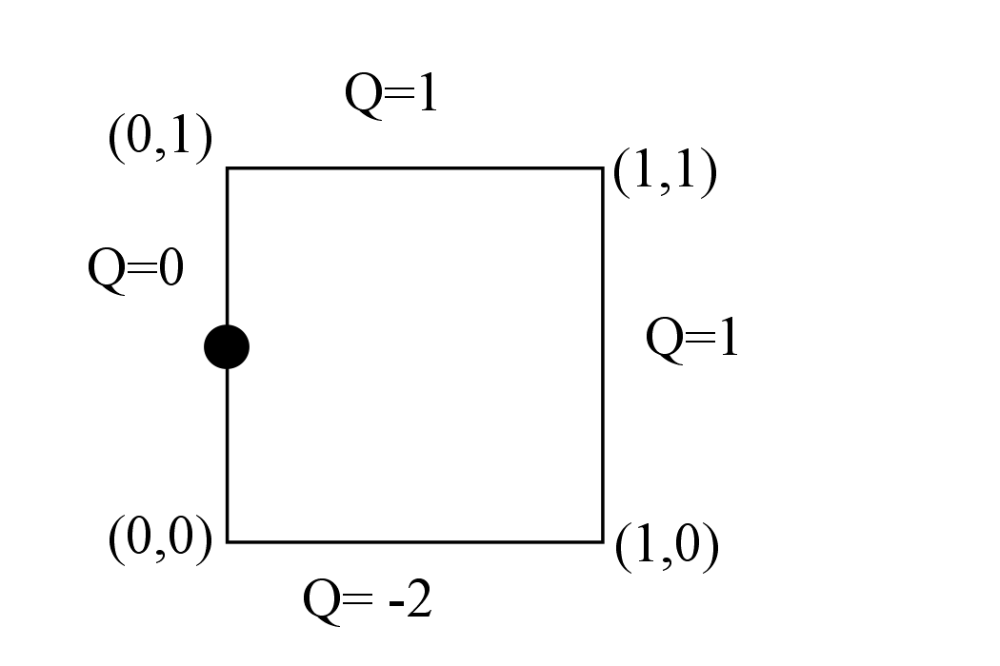

# 2.  Technical Basis

Particle tracking methods have significant computational advantages in many situations, especially in advection-dominated systems, but clearly require accurate methods for calculating groundwater velocity. The difficulty arises because numerical solution to the flow/pressure equation typically provides flow velocities at specific locations or in some other discretized form; flow velocity at any location within the computational domain of interest must then be reconstructed from the discretized solution. How this is accomplished is highly dependent on the choice of numerical method for the flow/pressure equation and on the type of grid.

For structured grids and finite-volume methods, Pollock’s method (Pollock, 1988) is widely used to establish streamlines. In Pollock’s method, an approximate analytical solution is used to move a streamline trajectory from the entrance point on a computational cell to the exit point. This method works directly on fluxes computed in a finite volume approximation and avoids explicit reconstruction of the velocity field.

Streamline tracing for unstructured grids is considerably more difficult, requiring in general flow velocity to be available everywhere in the spatial region of interest. Velocity fields must, as a consequence, be reconstructed from a discretized numerical solution. Painter et al. (2011) describe a method for reconstructing velocity fields from control-volume solutions to groundwater flow. Their method is the basis for Walkabout. In contrast to most previous work on streamline tracing on unstructured grids, the emphasis is on fully unstructured grids; i.e., no restrictions are placed on the number of faces on each control volume.

## 2.1 Random Walk Particle Tracking

The relations used to compute the random-walk particle trajectories that simulate the advection dispersion equation have been described in detail elsewhere (e.g. Tompson and Gelhar, 1990, Labolle et al., 1996, Lichtner et al., 2002). The well- known result for particle position at time \(t + \Delta t\) is

$$
\begin{align}
\label{eq:eq1}
\boldsymbol{X_p}(t + \Delta t) =
\boldsymbol{X_p}(t) + \boldsymbol{A}[\boldsymbol{X_p}(t)] \Delta t +
\boldsymbol{B} [\boldsymbol{X_p}(t)] \cdot \boldsymbol{Z} \sqrt{\Delta t}
\end{align}
$$

where \(\boldsymbol{X_p}\) is the particle location, \(\boldsymbol{Z}\) is a vector of three independent random numbers (mean of 0, variance of 1), and \(\boldsymbol{A}\) and \(\boldsymbol{B}\) are related to the porosity \(\theta\), velocity \(v\), and dispersion tensor \(\boldsymbol{D}\) as
 
$$
\begin{align}
\label{eq:eq2}
\boldsymbol{A} = \boldsymbol{v} + \nabla \cdot \boldsymbol{D} +
\frac{1}{\theta} \boldsymbol{D} \cdot
\nabla \theta
\end{align}
$$

$$
\begin{align}
\label{eq:eq3}
\boldsymbol{B} \cdot \boldsymbol{B}^T = 2 \boldsymbol{D}
\end{align}
$$

## 2.2  Reconstruction and Interpolation of the Velocity Field

The velocity \(\boldsymbol{v}\) is clearly needed at all points in space to simulating the random walk particle trajectories. Similarly, the dispersion tensor D, which depends on velocity, is also needed at all points in the domain of interest. The velocity field must be reconstructed from the discretized flow solution.

A subset of finite volume methods is considered, wherein the domain of interest has been partitioned into control volumes formed by perpendicular bisectors between adjacent nodes in an underlying triangulation of cell centers.
Specifically, a nodal network triangulated into a triangular (2-D) or tetrahedral (3-D) element mesh is presumed to be available. A control volume \(V_i\) is constructed around each node \(i\) in the triangulation (Figure 1) such that \(V_i\) is bounded by the set of perpendicular bisectors between node \(i\) and each of its neighbors. If Delaunay triangulation is used to construction the original triangulation, then the control volumes form the Voronoi tessellation. This particular restriction on the control volume based on perpendicular bisectors is imposed explicitly in FEHM and is a subset of the integrated finite difference (Narasimhan and Witherspoon, 1987) discretizations allowed in TOUGH2. Even in the more general case of TOUGH2, external grid generation software that are usually used to construct input mesh, typically impose similar restrictions. Note that this approach makes no assumption about the shape of the finite volume cell.

*Figure 1. Example triangulation and associated control volumes for a 25-node mesh in 2D. The triangulation is shown with dashed lines. The control-volume elements are shown as solid blue lines. The control volume and element boundaries coincide on the domain boundary.*

We further consider that a control-volume method with 2-point flux approximation has been used to solve for groundwater head. Specifically, the conservation equation is written for a control volume \(V_i\) as

$$
\begin{align}
\label{eq:eq4}
S_i \left| V_i \right| \frac{\partial h_i}{\partial t} =
\sum_{j \in N(i)} Q_{ij}
\end{align}
$$
 
where \(S_i\), \(h_i\) and \(V\) are the specific storage [\(L^{-1}\)], head [\(L\)] and volume [\(L^3\)] in cell \(i\), respectively. Here \(N(i)\) is the list of neighbors adjacent to cell \(i\),
\(Q_{ij} \equiv \int_{V_i \cap V_j} \boldsymbol{q} \cdot \boldsymbol{n_{ij}} ds\) is volumetric flow rate [\(L^3/T\)] through the face connecting cells \(i\) and \(j\), and \(n_{ij}\) is the unit normal on the same face.

Our interest is in the velocity vector \(\boldsymbol{v} = \boldsymbol{q} / \phi\) in the entire domain. However, the flow solution only provides the \(Q_{ij}\), the normal components of \(\boldsymbol{q}\) at each cell face. The approach proposed and tested here has two steps. In the first step, the \(Q_{ij}\) for each cell are used to construct an approximate representative value of \(\boldsymbol{q}\) for that cell (denoted \(\boldsymbol{q_i}\), for cell \(i\)). Second, the \(\boldsymbol{q_i}\) are then associated with the nodes and the original triangulation (dashed lines in Figure 1) is then used to interpolate to any point in the computational domain.
 
The first step is to reconstruct cell-centered velocities. To this end, we (temporarily) approximate \(\boldsymbol{q}\) as being constant in each cell. The volumetric flow rate across the face common to cells \(i\) and \(j\) then becomes \(Q_{ij} = \boldsymbol{q_i} \cdot \boldsymbol{A_{ij}}\) where \(\boldsymbol{A_{ij}} \equiv A_{ij} \boldsymbol{n_{ij}}\) is the vector area for the face. An analogous equation can be written for each face on the cell, thus producing the linear system for each cell \(i\)

$$
\begin{align}
\label{eq:eq5}
\boldsymbol{G_i} \boldsymbol{q_i} = \boldsymbol{\gamma_i}
\end{align}
$$

Here \(\boldsymbol{G_i}\) is a \(n \times d\) matrix, \(\boldsymbol{q_i}\) is \(d \times 1\), and \(\boldsymbol{\gamma_i}\) is \(n_i \times 1\), \(n_i\) is number of neighbors for cell \(i\), and \(d\) is dimensionality of the space. Each row of the \(\boldsymbol{G_i}\) matrix is the vector area for one face. The columns vector \(\boldsymbol{\gamma_i}\) is the volumetric flow rate across the faces, as calculated by the control volume flow code. The column vector \(\boldsymbol{q_i}\), the darcy flux for the cell, is the unknown.

In two dimensions, a control volume has a minimum of 3 sides and in many applications involving an unstructured grid will have more. Similarly, a control volume in 3-D has 4 or more sides. Thus, equation \(\eqref{eq:eq5}\) is an \(n_i \times d\) system with \(n_i > d\); i.e. it is an overdetermined system. Following standard techniques, a least- squares estimate \(\hat{q_i}\) can be constructed for the darcy velocity \(\boldsymbol{q_i}\)
 
$$
\begin{align}
\label{eq:eq6}
\boldsymbol{\hat{q_i}} = 
\left( \boldsymbol{G}^T \boldsymbol{G} \right) ^ {-1}
\boldsymbol{G}^T \boldsymbol{\gamma}
\end{align}
$$
 
where the subscript \(i\) on \(\boldsymbol{G}\) and \(\gamma\) has been suppressed for readability. An estimate of the velocity for the cell is then obtained as \(\boldsymbol{\hat{v_i}} = \frac{\hat{q_i}}{\phi} \) where \(\phi\) is porosity in the cell.

For the types of grids considered here, nodes are specified on the domain boundaries (see Figure 1). For nodes on Dirichlet boundaries, Equation \(\eqref{eq:eq6}\) can be applied as for interior nodes. For nodes on Neumann type boundaries, the specified flux constraint must be included, which leads to a linearly constrained linear least squares problem for the boundary flux vector \(\boldsymbol{\hat{q_i^b}}\) in the \(i\)-th cell
 
$$
\begin{align}
\label{eq:eq7}
\boldsymbol{\hat{q_i^b}} = \underset{q_i}{\mathrm{arg\,min}}
\left| \left| \boldsymbol{G} \boldsymbol{q_i} - \gamma \right| \right|
\mathrm{\:subject\:to\:} \boldsymbol{Bq_i} = 
\boldsymbol{\beta}
\end{align}
$$
 
where \(\boldsymbol{B}\) is a \(n_i^b \times d\) matrix, and \(\beta\) is \(n_i^b \times 1; n_i^b < d\) is the number of boundary faces for the cell in question. The matrix \(\boldsymbol{B}\) and the column vector \(\boldsymbol{\beta}\) are analogous to \(\boldsymbol{G}\) and \(\boldsymbol{g}\) but are written for the subset of faces for the cell in question that lie on the boundary. Explicit solutions are available (e.g. Amemiya, 1985)

$$
\begin{align}
\label{eq:eq8}
\boldsymbol{\hat{q_i^b}} = \boldsymbol{\hat{q_i}} -
\left( \boldsymbol{G}^T \boldsymbol{G} \right) ^ {-1}
\boldsymbol{B} \left( \boldsymbol{B}^T \left( \boldsymbol{G}^T \boldsymbol{G} \right) ^ {-1} \boldsymbol{B} \right) ^ {-1}
\left( \boldsymbol{B\hat{q_i}} - \boldsymbol{\beta} \right)
\end{align}
$$
 
with Equation \(\eqref{eq:eq6}\) for \(\boldsymbol{\hat{q_i}}\). In the event that \(n_i^b = d\) (i.e. for nodes at the corners of the domain) the boundary conditions alone determine the nodal velocities.

As a simple example for which an intuitively reasonable result is apparent, consider a finite-volume cell on the left boundary of a 2-D rectangular domain with dimensions, intercell fluxes and boundary flux as shown in Figure 2. Unconstrained reconstruction from Equation \(\eqref{eq:eq6}\) gives \((-1/2, -3/2)\) for the darcy flux, equivalent to simply averaging the intercell fluxes on the left and right side to get x-velocity and averaging the top and bottom fluxes to get y-velocity. Using the constrained reconstruction Equation \(\eqref{eq:eq8}\) gives \((0, -3/2)\). Thus, the normal component of the darcy flux at the boundary is forced to honor the imposed no- flow condition at the boundary. These results could be intuited for the simple geometry shown in Figure 2; the utility of Equations \(\eqref{eq:eq6}\) and \(\eqref{eq:eq8}\) lies in the fact that the procedure works for finite volume cells of any shape.

*Figure 2. A control volume on the left boundary of a computational domain. Node location is shown as the black dot. The coordinates of the control volume vertices are shown in parenthesis. The volumetric fluxes Q [\(L^3/T\)] are shown for each face (positive values indicate flow into the cell). The unconstrained velocity reconstruction equation Equation 6 gives \((-1/2, -3/2)\). The boundary constrained version Equation 7 gives \((0,-3/2)\); i.e. it forces the no-flow condition on the left side to be honored.*

Equations 6 or 8 can be applied to each cell \(i\) to obtain a discrete representation of the velocity field. The assumption of constant velocity in each cell, which was used to develop Equations 6 and 8, results in discontinuous velocities at cell faces. Discontinuous velocities can lead to mass balance errors and are generally inadequate for pathline tracing. However, these discontinuities can be easily removed through a simple smoothing procedure. Specifically, we reinterpret each \(\boldsymbol{v_i}\) as being applicable at the nodal position in the original finite element mesh. Using standard barycentric coordinates, the velocities can then be interpolated without discontinuities to any position in the domain. Note also, that derivatives of the velocity, which are needed to properly calculate dispersion tensors in a random walk particle-tracking model, are readily available from the shape functions.

### Dispersive and Advective Displacements

Given the ability to interpolate \(\boldsymbol{v}\) to any point in the domain, it is a simple matter to then solve for a particle’s position. A first-order predictor-corrector method weighted to the corrector is used in Walkabout for the advective displacement. The dispersive step is first-order Euler.

The time step is adaptive based on the local value of the effective velocity (\(\boldsymbol{A}\) term in Eq. \(\eqref{eq:eq2}\)) and the dispersion tensor. The time step is taken to be the smaller of \(t_1\) and \(t_2\), where

$$
\begin{align}
\label{eq:eq9}
t_1 = f_c \frac{\overline{l}}{v}
\end{align}
$$

$$
\begin{align}
\label{eq:eq10}
t_2 = f_d \frac{\overline{l^2}}{4(\alpha v + D_m)}
\end{align}
$$

where \(v\) is groundwater speed, \(D_m\) is molecular diffusion coefficient, \(\overline{l}\) is the characteristic linear dimension of the local finite volume cell (cube root of the cell volume), and \(\alpha\) is maximum of the longitudinal, transverse vertical, and transverse horizontal dispersivities. The parameters \(f_c\) and \(f_d\) are user-defined limits on the time step expressed as fractions of the characteristic times for advective and dispersive displacements, respectively.

If an advective time step causes a particle to cross a no-flow boundary, the time step is recursively decreased until the step does not cause the particle to cross the boundary. Dispersive steps that cause a particle to cross a no-flow boundary are rejected.
