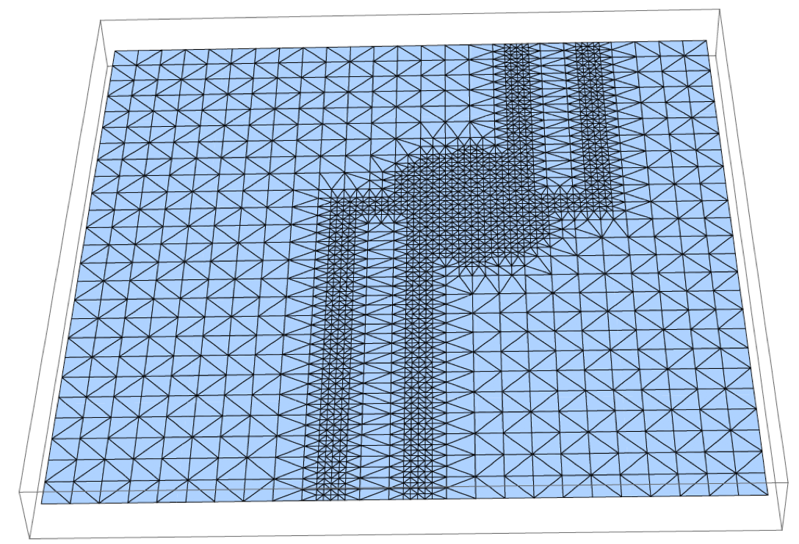
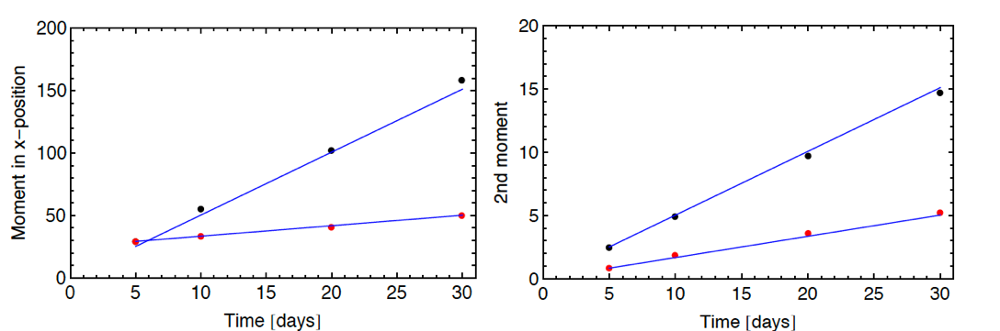
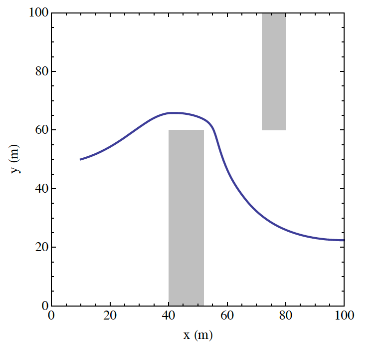
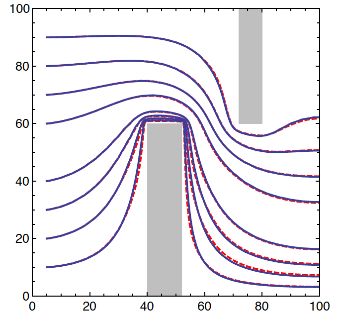

# 4. Verification Tests

Four verification tests are included with the Walkabout distribution.

## 4.1 Verification Test 1

In the first verification test, particles are released form a point source into a uniform flow aligned with the x-axis. The 1st and 2nd moments of the particle positions at time t have analytical solutions for this configuration. The 1st moment of the particle position is \((vt,0,0)\), where \(v\) is flow speed. The 2nd moment is \((2\alpha_L vt, 2 \alpha_T^H vt, 2 \alpha_T^V vt)\) where \(\alpha_L\) is longitudinal dispersivity, \(\alpha_T^H\) is horizontal transverse dispersivity, and \(\alpha_T^V\) is vertical transverse dispersivity.

The flow speed in Test 1 is 0.839 m/day. The computational domain is 100 m x 100 m x 100 m. There are four variants of Test 1, with different dispersivity values (Table 1). Tests 1a – 1c use a regular grid with 26 nodes in each direction. Test 1d uses an unstructured grid with uniform properties (Figure 3). Note that the computational cell size is 4 m in each direction in Tests 1a – 1c. For Test1d, the smallest grid size is 1 m in the direction of flow. The grid Peclet numbers range from 1.33 to infinity for these tests.

Results from Verification Tests 1a – 1c are shown in Figures 4 – 7. In each figure, the individual points are from Walkabout and the lines are the theoretical results.

|         | Grid                       | \(\alpha_L (m)\) | \(\alpha_T^H (m)\) | \(\alpha_T^V (m)\) |
|---------|----------------------------|------------------|--------------------|--------------------|
| Test 1a | Regular, 26x26x26          | 1                | 0.1                | 0.01               |
| Test 1b | Regular, 26x26x26          | 3                | 0.1                | 0.3                |
| Test 1c | Regular, 26x26x26          | 0                | 1                  | 1                  |
| Test 1d | Unstructured, 179925 cells | 1                | 0.2                | 0.1                |

*Table 1. Grid type and dispersivity values for Verification Test 1.*

*Figure 3. Horizontal slice from unstructured grid used in Test 1d. The grid is uniform in the vertical direction (not shown). Flow properties are uniform in this test. Flow is from left to right (uniform flow).*

*Figure 4. Result from Verification Test 1a. Shown on left are 1st (red dots) and 2nd (black dots) moments in x-position from Walkabout along with theoretical results (lines). Shown on right are 2nd moments in y-position (red dots) and z-position (black dots) along with theoretical results (lines).*

*Figure 5. Result from Verification Test 1b. Shown on left are 1st (red dots) and 2nd (black dots) moments in x-position from Walkabout along with theoretical results (lines). Shown on right are 2nd moments in y-position (red dots) and z-position (black dots) along with theoretical results (lines).*

*Figure 6. Result from Verification Test 1c. Shown on left are 1st (red dots) and 2nd (black dots) moments in x-position from Walkabout along with theoretical results (lines). Shown on right are 2nd moments in y-position (red dots) and z-position (black dots) along with theoretical results (lines).*

*Figure 7. Result from Verification Test 1d. Shown on left are 1st (red dots) and 2nd (black dots) moments in x-position from Walkabout along with theoretical results (lines). Shown on right are 2nd moments in y-position (red dots) and z-position (black dots) along with theoretical results (lines).*

## 4.2 Verification Test 2

Verification Test 2 is designed to test Walkabout in a nonuniform flow field. The grid is the same as Test 1d. Lower permeability is assigned to two regions, creating two non-overlapping barriers (Figure 8). A flow streamline around the two barriers is also shown in Figure 8. The travel distance along the streamline is
115.6 m. The travel time for flow tracer is 230.5 days.

In Test2, particles are released at the point (10,50,50) and tracked through the system without transverse dispersion. Two variants are considered with longitudinal dispersivity of 1 and 10 m.

Without transverse dispersion, particles should travel along the streamline upon which they are launched. Given the total travel distance and the total travel time along the streamline and adopting a Lagrangian transport perspective, the cumulative distribution of arrival times for particles at the outflow is given by Equation A-2 of Painter et al. (2008) irrespective of the streamline meander or velocity variability along the streamline. A comparison of the Walkabout results and Equation A-2 of Painter et al. (2008) is shown in Figure 9.

*Figure 8. Horizontal projection of flow streamline for Verification Test 2. Particles are released on this streamline and tracked without transverse dispersion.*

*Figure 9. Results from Verification Test 2. Shown are cumulative distributions of particle arrival time from Walkabout (red dots) compared with theoretical results (blue curves) for dispersivity of 1 m and 10 m. Note the arrival time is shown normalized by the non-dispersive travel time (230.5 days).*

## 4.3 Verification Test 3

Verification Test 3 compares Walkabout streamline tracing to the SPTR module of FEHM without dispersion. The flow configuration is the baffled flow configuration as in Verification Test 2. In this test, 8 streamlines are traced through the system with SPTR and Walkabout. Both trajectories and arrival times are compared.

Trajectories are shown in Figure 10. The trajectories overplot each other and only small differences are discernable. Note that Walkabout and SPTR use different streamline tracing algorithms. The good agreement between the two thus helps build confidence in both codes.

A cross-plot of SPTR and Walkabout arrival times is shown in Figure 11. The blue line is the line of perfect agreement. Again there is an excellent agreement between the two codes over the entire range tested.

*Figure 10. Results of Verification Test 3. Shown are horizontal projections of streamlines calculated by SPTR (solid blue) and Walkabout (red dashed).*

*Figure 11. Result of Verification Test 3. Shown is a crossplot (red dots) of Walkabout arrival times versus SPTR times. The solid blue line has slope 1 (line of perfect agreement).*

## 4.4 Verification Test 4

Verification Test 4 is a simple flow-through configuration with cross-section of 100 m • 100 m and length 20,000 m. The groundwater velocity is 1.96 ft/day. There are 106, 4 and 4 nodes in the x-, y-, and z- directions, respectively. The grid is uniform with 200 m spacing in the x direction except for the region from 10000 m to 11000 m where it is refined to 100 m.

For this test, Walkabout particle tracks are post-processed to create concentration versus distance at a single time, using the procedure of Robinson et al. (2010). A helper program PCLITE is included with the Walkabout distribution to postprocess the Walkabout results.

Concentration versus position at 5500 days is shown in Figure 12. The solid curve is the analytical solution from Kreft and Zuber (1978). The dots are the result of the Walkabout. The agreement is good over the entire domain. The slightly smaller concentration in the first cell is a dilution effect caused by the fact that the particles are released at x=10 m and not on the inlet boundary. Note that there are no artifacts in the refined grid region from 10,000 m to 11,000 m.

*Figure 12. Result of Verification Test 4. Shown is concentration versus distance at 5500 days. Black dots are the result of Walkabout after post-processing using the procedure of Robinson et al. (2010). The blue curve is the analytical solution from Kreft and Zuber (1978).*