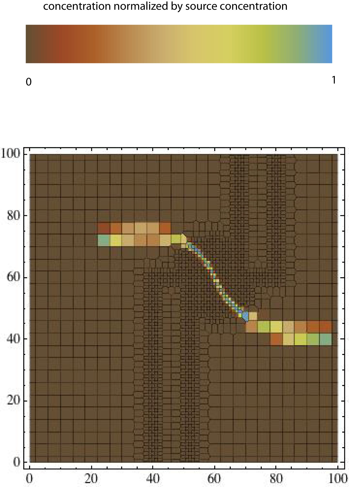
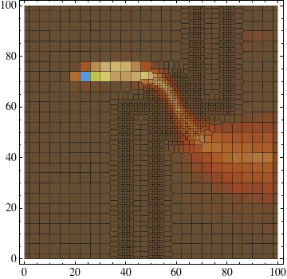
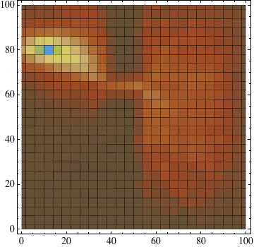

# 5.  Acceptance Tests

## 5.1 Acceptance Test 1

Acceptance Test 1 uses the same unstructured grid and flow barriers as in Verification Test 3. Particles are tracked with and without dispersion. The test is
 
intended to check for non-physical effects on a realistic flow/transport configuration involving strong permeability contrasts and unstructured grids.

Results with and without dispersion are shown in Figures 13 – 15. In producing these figures, Walkabout particle tracks were generated assuming an instantaneous release of particles. These particle tracks were then used to generate concentrations for a continuous source following the procedure of Robinson et al. (2010).

Anomalous accumulation of particles in low-permeability zones is a long-standing issue with random-walk particle tracking codes. Even in the case of relatively large dispersion (smallest grid Peclet number in Figure 15 is 0.25), no significant accumulation of particles is observed in low permeability zones.

*Figure 13. Horizontal slice of concentration from Acceptance Test 1 for the case without dispersion.*

*Figure 14. Horizontal slice of concentration from Acceptance Test 1. The longitudinal, transverse horizontal and transverse vertical dispersivity values are 1 m, 0.1 m and 0 m, respectively. The color map is the same as in Figure 13*

*Figure 15. Horizontal slice of concentration from Acceptance Test 1. The longitudinal, transverse horizontal and transverse vertical dispersivity values are 5 m, 0.5 m and 0 m, respectively. The color map is the same as in Figure 13.*

## 5.2 Acceptance Test 2

Acceptance Test 2 is designed to further test for anomalous mass accumulation in low permeability cells. This test uses a structured grid. There are two barriers to flow separated by a one-cell gap. Results are shown in Figure 16. No anomalous mass accumulation is apparent in this demanding test.

*Figure 16. Horizontal slice of concentration from Acceptance Test 1. The longitudinal, transverse horizontal and transverse vertical dispersivity values are 5 m, 0.5 m and 0 m, respectively. The color map is the same as in Figure 13.*