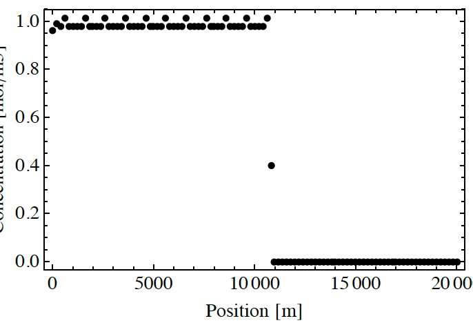
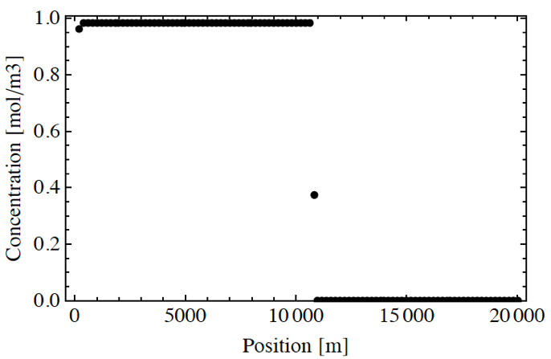

# 6 Known Issues

There are two known issues with Walkabout Version 1.0.

First, boundary facets for cells on a specified no-flow boundary must be aligned with the principal coordinate axes. This limitation is a consequence of the available information from the LaGrit software, which identifies boundary facets as “top”, “bottom”, “left”, etc., but does not provide a normal vector for each facet.

The second issue that the user should be aware of is that purely advective scenarios can, under certain conditions, produce spiky concentrations when post-processed by PLUMECALC or similar software. This phenomenon is demonstrated in Figure 17. At the end of each time step, Walkabout checks to
see whether a particle has left the current finite volume cell. If the particle has left the cell, then the exit time is recorded for post-processing by PLUMECALC. When only advection is modeled, the spatial step is constant and the time spent is rounded to the next larger integer multiple of the fixed time step for some cells and to the next smaller integer multiple of the time step for other cells, thus creating the spiky pattern shown in Figure 17. When averaged over several cells, the concentration is correct. In addition, any process that adds a random component to the time spent in a cell (e.g. dispersion, matrix diffusion, spread in the initial positions of the particles) reduces or eliminates this artifact. The artifact may also be eliminated by choosing the advective time step to make the number of time steps within each cell exactly an integer (Figure 18).

*Figure 17. Concentration calculated by post-processing the results of Walkabout using the algorithm of Robinson et al. (2010) showing an concentration artifact associated with purely advective transport. Rounding of the particle dwell time in the cell because of the finite-sized step size causes concentration in every 5th cell
to be overestimated with the rest underestimated slightly. The position of the front is in the correct position and the 5-cell average is correct in this case. Any process that adds a random component to the dwell time in a cell reduces or eliminates the artifact. It may also be eliminated by careful selection of the time step control parameters.*

*Figure 18. Same as in Figure 17, but with time step chosen to make the number of steps in each cell an integer. The artifact of Figure 17 is eliminated in this case.*